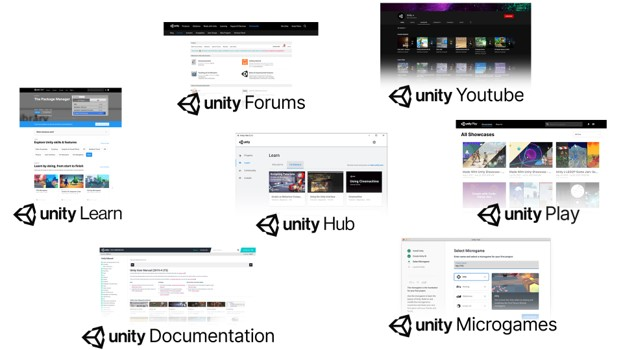
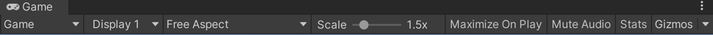
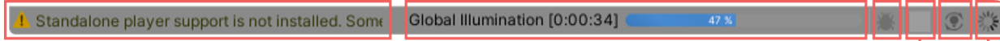

# INTRODUZIONE A UNITY

## Unity
Unity è un motore di gioco multipiattaforma che consente agli sviluppatori di creare giochi per PC, console, dispositivi mobili e altri dispositivi. È uno strumento molto popolare per la creazione di giochi, in particolare per giochi in 3D, ma è anche utile per creare giochi in 2D. Unity è noto per la sua facilità d'uso e la sua grande comunità di sviluppatori.

## Installazione Unity Hub
Iniziate ad esplorare Unity con l'Unity Hub, uno strumento che gestisce tutti i vostri progetti e installazioni. Utilizzare l'Hub per installare una o più versioni dell'Editor, creare nuovi progetti o aprire quelli esistenti.

- Scarica Unity Hub dal sito ufficiale di Unity.
- Apri il file scaricato e segui le istruzioni per l’installazione.
- Una volta installato, apri Unity Hub e seleziona la scheda “Installa”.
- Seleziona “Aggiungi” e scegli “Unity 2020.3 LTS”.
- Fai clic su “Avanti” e segui le istruzioni per l’installazione.

Si consiglia di utilizzare l'attuale supporto a lungo termine, o LTS

## Installazione
- Scarica il programma di installazione di Unity3D dal sito ufficiale di Unity: https://unity.com/
- Una volta scaricato, esegui il file di installazione facendo doppio clic sul file .exe o .dmg.
- Segui le istruzioni sullo schermo per completare l'installazione di Unity3D. Durante l'installazione, verrà chiesto di selezionare i componenti da installare. Scegli la configurazione che meglio si adatta alle tue esigenze, ma in generale è consigliabile installare tutti i componenti.
- Dopo l'installazione, fai clic sull'icona di Unity3D per avviare il programma. Al primo avvio, verrà chiesto di creare un account Unity o di accedere con un account esistente. È consigliabile creare un account, poiché questo ti darà accesso a funzionalità aggiuntive come la possibilità di caricare i tuoi giochi sulla piattaforma di gioco Unity.
- Una volta effettuato l'accesso, dovresti vedere la schermata di benvenuto di Unity3D. Da qui puoi scegliere di creare un nuovo progetto o aprire un progetto esistente.

In generale, l'installazione di Unity3D è piuttosto semplice e intuitiva. Se riscontri problemi durante l'installazione o hai bisogno di ulteriore assistenza, puoi fare riferimento alla documentazione ufficiale di Unity o alla sua comunità di supporto online.

## Version Control
Il controllo di versione è un sistema che consente di tenere traccia delle modifiche apportate al progetto nel tempo. Unity ha un proprio sistema di controllo di versione chiamato Unity Version Control (precedentemente Plastic SCM). Consente di gestire il codice sorgente e le risorse del progetto, collaborare con gli altri membri del team e monitorare le modifiche apportate al progetto nel tempo. È possibile utilizzarlo per creare rami, unire le modifiche, e ripristinare le modifiche, se necessario. È uno strumento potente che può aiutarti a gestire il tuo progetto in modo più efficiente ed efficace.

### Version Control: Plastic SCM o GitHub
Plastic SCM e GitHub sono due popolari strumenti di controllo di versione utilizzati con Unity. Il controllo di versione basato su Git offre una vasta gamma di funzionalità e supporto per la comunità, mentre Plastic SCM offre flessibilità per diversi flussi di lavoro e gestisce file di grandi dimensioni. Ciò che funziona meglio per un'organizzazione potrebbe non funzionare altrettanto bene per un'altra.

Secondo TrustRadius, Plastic SCM ha la migliore integrazione con Unity - zero problemi, nativo, semplice. GitHub sembra più stabile, ma per i più piccoli e indie Plastic è più semplice. Inoltre, non c'è bisogno di strumenti extra come GitKraken, GitLab, Sourcetree , Fork, ecc. 

## Introduzione
- Utilizzo dell'Editor di Unity per creare scena del gioco, posizionare oggetti, e configurare le proprietà.
- Utilizzo dei componenti di Unity per aggiungere fisica e interazione agli oggetti del gioco.
- Creazione di script di Unity per controllare il comportamento degli oggetti del gioco.
- Utilizzo di sprite e animazioni per creare grafica del gioco.
- Creazione di suoni e musica utilizzando l'Audio Mixer di Unity.
- Implementazione della logica del gioco utilizzando C#.

### Utilizzo dell'Editor di Unity per creare la scena del gioco
- Unity fornisce un editor visuale per la creazione di scene del gioco.
- È possibile trascinare e rilasciare gli oggetti sulla scena e posizionarli come desiderato.
- L'editor consente anche di modificare le proprietà degli oggetti, come la posizione, la rotazione e la scala.

### Utilizzo dei componenti di Unity per aggiungere fisica e interazione agli oggetti del gioco
- Unity include una vasta gamma di componenti per aggiungere fisica e interazione agli oggetti del gioco.
- Ad esempio, i componenti di Collider e RigidBody possono essere utilizzati per creare oggetti fisici che interagiscono con il mondo del gioco.
- I componenti di Input e AudioSource possono essere utilizzati per gestire l'input del giocatore e riprodurre suoni nel gioco.

### Creazione di script di Unity per controllare il comportamento degli oggetti del gioco
- Unity supporta lo scripting in C#, che consente di creare script per controllare il comportamento degli oggetti del gioco.
- È possibile utilizzare gli script per controllare il movimento degli oggetti, la loro interazione con altri oggetti, e altro ancora.
- Unity include anche una vasta gamma di librerie e API per semplificare la scrittura di script.

### Utilizzo di sprite e animazioni per creare grafica del gioco
- Unity supporta la creazione di grafica di gioco utilizzando sprite e animazioni.
- È possibile importare immagini sprite e utilizzarle per creare personaggi, oggetti e sfondi del gioco.
- È anche possibile creare animazioni utilizzando l'editor di animazione di Unity, che consente di animare il movimento degli oggetti e le espressioni facciali dei personaggi.

### Creazione di suoni e musica utilizzando l'Audio Mixer di Unity
- Unity include un Audio Mixer che consente di creare e mixare suoni e musica per il gioco.
- È possibile importare file audio e utilizzarli nel gioco, e utilizzare il mixer per regolare il volume e gli effetti audio.
- Unity supporta anche l'implementazione di effetti sonori, come riverbero, delay e chorus.

### Implementazione della logica del gioco utilizzando C#
- L'implementazione della logica del gioco è spesso gestita tramite script in C#.
- È possibile utilizzare gli script per gestire gli aspetti del gioco come la fisica, la logica di gioco, e la gestione degli eventi.
- Unity supporta anche la creazione di controlli dell'interfaccia utente, come pulsanti e schermate di gioco.

### Conclusioni
Unity è un'ottima piattaforma per la creazione di giochi.
Con la sua interfaccia utente intuitiva, la vasta gamma di componenti e funzionalità, e il supporto per lo scripting in C#, Unity fornisce agli sviluppatori di giochi un ambiente completo per creare giochi di successo.
Se sei interessato ad approfondire l'utilizzo di Unity per la creazione di giochi, ti consigliamo di consultare le risorse online, come la documentazione ufficiale di Unity, forum di discussione e tutorial su YouTube.
Buona creazione di giochi!

# INTERFACCIA

## Tollbar
La Toolbar fornisce l'accesso al tuo account Unity e ai servizi cloud di Unity. Contiene inoltre i controlli per la modalità Play, Unity Search, un menu di visibilità dei layer e il menu del layout dell'Editor

## The Hierarchy window
- La finestra Gerarchia è una rappresentazione testuale gerarchica di ogni GameObject nella  scena.Ogni oggetto ha una voce nella gerarchia, quindi le due finestre sono intrinsecamente collegate. La gerarchia rivela la struttura di  come i GameObject si collegano tra loro.
- Puoi ordinare e raggruppare i GameObject che usi in una scena. Quando aggiungi o rimuovi GameObject nella vista Scena, li aggiungi o rimuovi anche dalla finestra Gerarchia.

### The Hierarchy window - Parenting
Unity utilizza il concetto di gerarchie padre-figlio o "parenting" per raggruppare i GameObject. Un oggetto può contenere altri GameObject che ereditano le sue proprietà. Puoi collegare i GameObject per aiutare a spostare, scalare o trasformare una collezione di GameObject. Quando sposti l'oggetto di livello superiore o parent GameObject, sposti anche tutti i GameObject figlio.

## The Game view
La vista Gioco simula l'aspetto finale del tuo gioco renderizzato attraverso le   tue telecamere della scena. Quando fai clic sul pulsante Play, la simulazione inizia.

## Game view Control Bar
Utilizza la barra di controllo per regolare le impostazioni di visualizzazione, ingrandire o ridurre lo zoom e attivare o disattivare l'audio e le statistiche. Il menu Gizmos controlla la visibilità dei GameObject nella vista Scena e Game. 

## The Scene 
La vista della scena è la tua vista interattiva nel mondo che stai creando. Puoi utilizzare la vista della scena per selezionare e posizionare scenari, personaggi, telecamere, luci e tutti gli altri tipi di GameObjects. Il GameObject è l'oggetto fondamentale nelle scene di Unity, che può rappresentare personaggi, oggetti, scenari, telecamere, punti di passaggio e altro ancora.  La funzionalità di un GameObject è definita dai componenti ad esso allegati. 

## Overlays
Overlays di Unity è uno strumento che fornisce accesso rapido ai pannelli dell'editor di Unity, mostrandoli come pannelli sovrapposti nella finestra Scene view. In questo modo, gli utenti possono personalizzare i pannelli dell'editor, posizionarli sulla finestra della Scene view e salvare le configurazioni personalizzate come preset per riutilizzarle e condividerle.

| A | Tools |
| B | View Options |
| C | Grid and Snap Toolbar |
| D | Orientation |
| E | Search |
| F | Tool Settings |

## The Inspector window
La finestra Inspector in Unity 3D mostra le proprietà e i componenti del GameObject selezionato nella Scene view. Consente di modificare le proprietà dei GameObject, come la posizione, la scala e la rotazione, nonché di aggiungere, rimuovere o modificare i componenti che definiscono il comportamento del GameObject. Inoltre, è possibile visualizzare le informazioni sui materiali, le texture, le luci e altri oggetti presenti nella scena.

## The Project window
La finestra Progetto (Project window) di Unity è uno strumento essenziale per organizzare e gestire i contenuti del tuo progetto. In questa finestra, puoi visualizzare e manipolare tutti i file che compongono il tuo progetto, inclusi modelli 3D, immagini, suoni e script.
La finestra Progetto è suddivisa in due sezioni principali: la visualizzazione a sinistra elenca tutte le cartelle e i file del progetto

- La visualizzazione a destra mostra una visualizzazione dettagliata del file selezionato. Puoi anche trascinare e rilasciare i file dalla finestra Progetto direttamente nella Scene view o nell'Inspector window per modificarli o utilizzarli nei tuoi script.
- La finestra Progetto ti consente inoltre di creare nuove cartelle, rinominare o eliminare file esistenti, filtrare i file per tipo e importare nuovi asset nel tuo progetto. È uno strumento potente e versatile che ti aiuterà a tenere tutto sotto controllo e a organizzare il tuo lavoro in modo efficiente.

## The status bar
- La barra di stato di Unity si trova nella parte inferiore dell'Editor e fornisce informazioni importanti sul progetto attuale. In particolare, la barra di stato mostra il nome del progetto, l'attività del processo di compilazione, il numero di oggetti selezionati nella Scene view e lo stato della connessione al servizio cloud Unity Collaborate, se abilitato.
- La barra di stato di Unity è particolarmente utile per monitorare lo stato di esecuzione dei processi, tenere traccia dei problemi di connessione e tenere sotto controllo il numero di oggetti selezionati nella scena corrente. Inoltre, la barra di stato può essere personalizzata per visualizzare solo le informazioni di cui hai bisogno, come ad esempio attivare o disattivare l'indicatore di connessione Collaborate o la visualizzazione dei log.

# CREATE GAMEPLAY

## Scene
- Le scene sono dove lavori con il contenuto in Unity. Sono asset che contengono tutto o parte di un gioco o di un'applicazione. Ad esempio, potresti costruire un gioco semplice in una singola scena, mentre per un gioco più complesso, potresti utilizzare una scena per ogni livello, ognuno con i propri ambienti, personaggi, ostacoli, decorazioni e UI. Puoi creare qualsiasi numero di scene in un progetto.
- Quando crei un nuovo progetto e lo apri per la prima volta, Unity apre una scena di esempio che contiene solo una fotocamera e una luce.

## GameObjects
- I GameObjects sono gli oggetti fondamentali in Unity che rappresentano i personaggi, gli oggetti di scena e l'ambiente. Tuttavia, i GameObjects non fanno molto da soli, ma agiscono come contenitori per i componenti che implementano la funzionalità. 

- Per dare a un GameObject le proprietà di cui ha bisogno per diventare una luce, un albero o una telecamera, è necessario aggiungere componenti ad esso. Ci sono molti tipi di componenti predefiniti in Unity e puoi anche creare i tuoi componenti utilizzando l'API di scripting di Unity. Inoltre, ogni GameObject ha sempre un componente Transform allegato per rappresentare la posizione e l'orientamento.

## Prefabs
Il sistema di Prefab di Unity consente di creare, configurare e archiviare un GameObject completo con tutti i suoi componenti, valori delle proprietà e GameObject figlio come una risorsa riutilizzabile. L'asset di Prefab funge da modello da cui è possibile creare nuove istanze di Prefab nella scena. Convertire un GameObject in un Prefab consente di riutilizzarlo in più posizioni nella scena o in più scene del progetto, mantenendo tutte le copie sincronizzate automaticamente. Le modifiche apportate all'asset di Prefab si riflettono automaticamente nelle istanze di quel Prefab, consentendo di apportare facilmente modifiche in tutto il progetto. I Prefab possono essere nidificati per creare gerarchie complesse di oggetti.

## Asset Workflow
Il flusso di lavoro degli asset di Unity prevede l'importazione degli asset, la creazione di contenuti con essi, la compilazione, la distribuzione e il caricamento dei file.

# Fonti
[Working in Unity – Unity Documentation](https://docs.unity3d.com/Manual/UnityOverview.html)

[UNITY GAME DEV FIELD GUIDE](https://docs.unity3d.com/Manual/best-practice-guides.html)
