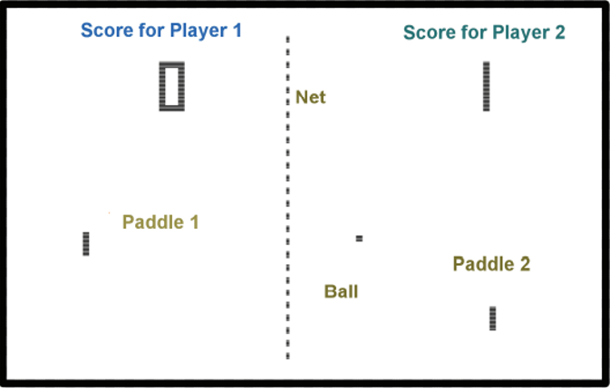
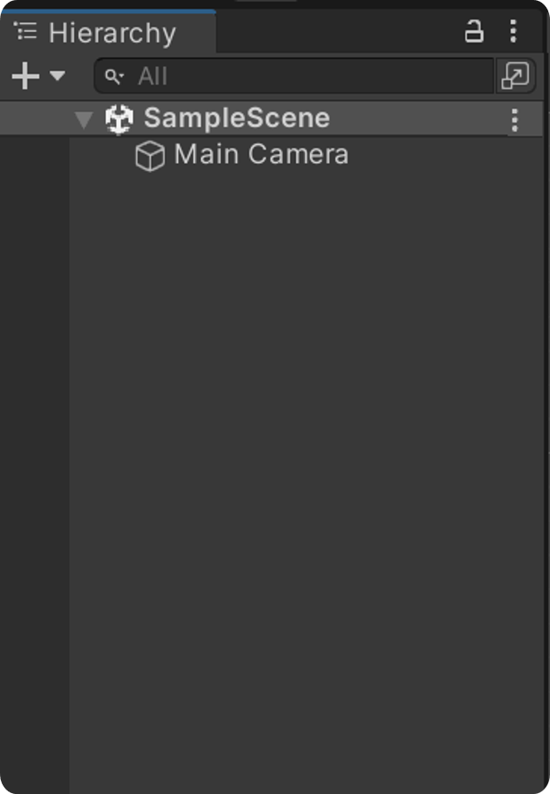
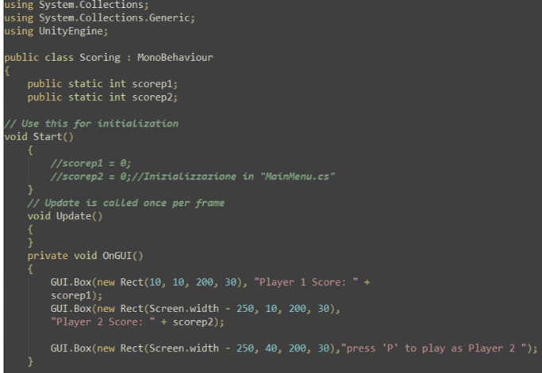

# DESIGN
## Pong, Atari (1972)
- Il gameplay di Pong è incredibilmente semplice. Due giocatori controllano ciascuno un pad e devono provare a mantenere la palla in gioco facendola rimbalzare sulle loro piattaforme.
- La sola differenza tra Pong e Ping Pong è il fatto di essere giocato su uno schermo. La fisica è semplice, e i controlli dei pad per ogni giocatore sono delegati a queste piattaforme invece di impugnare una racchetta fisica.

Gli elementi di design consistono in soli sei oggetti: 2 sistemi di punteggio (uno per ogni giocatore), 2 pad o racchette, una palla e una rete delimitata dalla linea tratteggiata.
I giocatori possono solo muovere i pad su e giù per toccare la palla. Il sistema di punteggio è molto familiare e autoesplicativo. La fisica è semplice ma poco realistica. Non c'è gravità, attrito o effetti di movimento complessi. Questo look pulito contribuisce al successo del gioco.

## Regole di Design:
1. **La Regola della semplicità**: rendilo semplice!
   - La semplicità è il segno distintivo del game design. Spesso, i progettisti raggiungono la semplicità dopo un percorso arduo e complesso. Anni di sviluppo sono necessari per raggiungere questo risultato. Il nemico della semplicità sono le funzionalità aggiunte che spesso diluiscono e rovinano il gioco originario.
2. **Regola dell'immediatezza**: Inizia il gioco immediatamente.
   - Molti videogiochi moderni infrangono questa regola, ma i giocatori non vogliono aspettare. Vogliono iniziare il gioco subito. Un buon modo di vedere questa regola è permettere solo un 5% del tempo per le istruzioni o interagire con i menù prima di iniziare il gameplay vero e proprio.
3. **Regola della curva di difficoltà**: Rampa di difficoltà da facile a difficile.
   - Nei giochi multiplayer, la difficoltà cresce con l'abilità dell'avversario. I giochi di successo offrono generose ricompense al superamento di compiti difficili.
4. **Regola del test**: Testa il gioco per assicurarti che sia divertente.
   - Testare i giochi è essenziale. È importante che il gioco sia adeguato, né troppo facile né troppo difficile. Queste domande possono essere risposte solo attraverso un campione rappresentativo di possibili giocatori.

## Creare un gioco stile Pong (Paddle game)
Come esercizio, realizzeremo un gioco costruendo un prototipo tramite Unity. Le regole sono semplici: ogni giocatore deve far rimbalzare la palla verso l'avversario. Se un giocatore manca di colpire la palla, il rivale segna un punto. Il primo che raggiunge un determinato punteggio, vince.

Il primo passo è visualizzare il campo da gioco. Potrete utilizzare semplicemente dei colori, oppure una figura rettangolare con i bordi per iniziare.

# SVILUPPO
## Creazione del progetto
Creare un nuovo progetto Unity con il nome "Pong paddle game" nella vostra cartella dei progetti di Unity. Utilizzate il 2D core di default.

## Layout
Usare il layout con cui si è più comodi, selezionandolo dalla parte superiore destra.

## Creare la prima scena
A questo punto dovrebbe essere presente la scena principale del gioco "Sample Scene" nella finestra Hierarchy.

Impostare in "Main Camera" MSAA (Multisample antialiasing) su off, dato che nel nostro gioco non avremo bisogno di smussare gli angoli dei poligoni ma avremo semplici oggetti bidimensionali.

## Elementi del gioco
Concentriamoci sugli elementi principali in 2D: il campo di gioco, le racchette, la palla e i loro confini.

## 2D Object
Creiamo un 2D Object di forma quadrata dalla finestra "Hierarchy".

## Campo di gioco
Rinominiamo l'oggetto square "Playfield" e assegnamo uno Sprite Renderer per dargli una certa forma e colore, utilizzando sprite di default oppure personalizzati. Consideriamo il sorting layer per i livelli di altezza. Nel nostro caso, impostiamo tutto sul livello default.

## Material
Possiamo creare un Material predefinito da utilizzare ogni volta che ci è utile. In grandi progetti, è buona norma utilizzare questa tecnica per mantenere coerenza visiva. Basta trascinare il material dentro lo sprite ed è fatto.

## Costruire le racchette
Creiamo i 2 paddle (racchette) sinistro e destro, assegnando il materiale creato in precedenza. Aggiungiamo il componente Box Collider, che rende la racchetta capace di gestire le collisioni.

## Script P1
Creiamo uno script per far muovere le racchette con la palla. Iniziamo con lo script per la racchetta sinistra, utilizzando la classe `Input.GetKey` per i comandi da tastiera. Definiamo i bordi superiore e inferiore per limitare il movimento.

Ripetiamo le stesse operazioni per il paddle destro, con le coordinate opposte. Il secondo giocatore può interagire con questo paddle attraverso l'uso delle freccette.

## Physical Material
Costruiamo un materiale fisico "Bounce" per rendere la palla rimbalzante. Non consideriamo l'attrito, quindi impostiamo il parametro Bounciness ad 1.

## Fisica e interazione della palla
Analizziamo la fisica intorno alla palla, aggiungendo i componenti Rigidbody e Sphere Collider. Impostiamo il raggio per determinare la precisione del punto di contatto.

Passiamo al codice: inizialmente la palla rimane ferma, in attesa per 3 secondi del metodo "WaitForIt". Quando inizia la partita, la palla si muove in una direzione casuale con una velocità variabile.

## Bordi del campo
Costruiamo i confini (bordi) del campo per impedire agli oggetti di uscire. Creiamo un bordo per ogni lato: Up-Down e Left-Right. Gli Up-Down avranno lo sprite di un rettangolo bianco e effetto bounciness, mentre i Left-Right avranno anche uno script per segnare i punti.

## Effetti audio
Introduciamo la sorgente audio. Aggiungiamo un suono "puck" ogni volta che avviene una collisione. Utilizziamo il metodo Play on Awake e il metodo "play" dalla classe AudioSource per gestire l'audio e il volume.

## Funzione punteggio
Creiamo un Game Object vuoto e lo rinominiamo "Score". Assegniamo uno script per implementare l'interfaccia del punteggio e visualizzare i relativi punti nella parte superiore dello schermo.

Con questi passaggi, siamo pronti a testare il gioco Pong. Verificate che tutti gli oggetti e le regole siano state applicate correttamente e divertitevi con il vostro gioco!

---